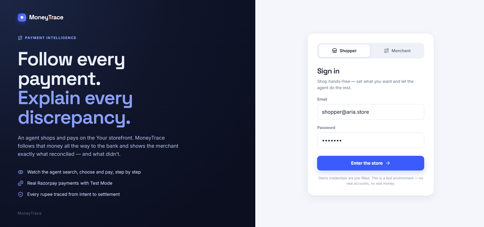
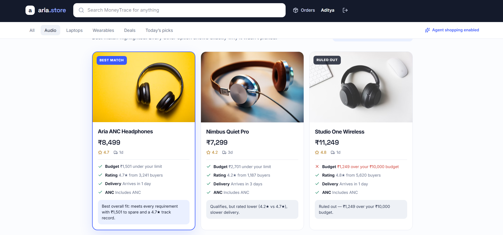
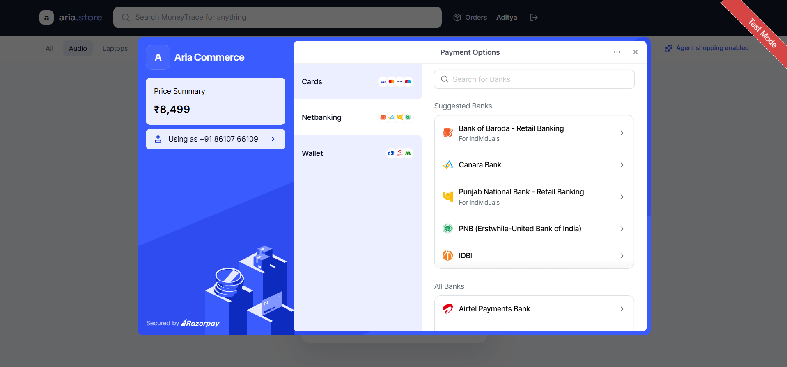
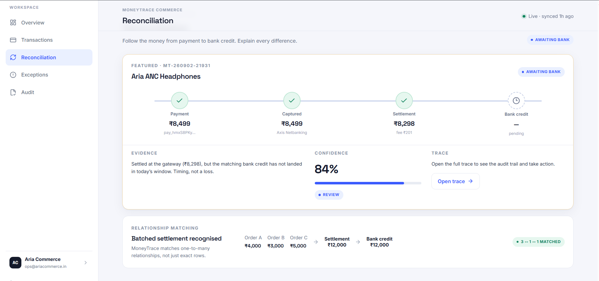
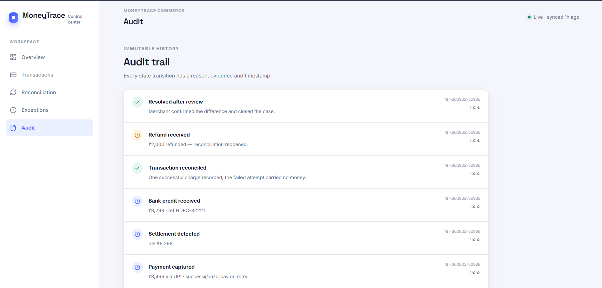
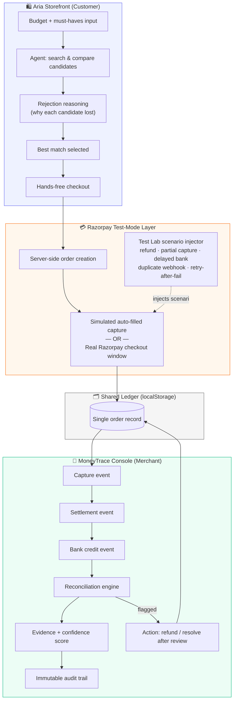
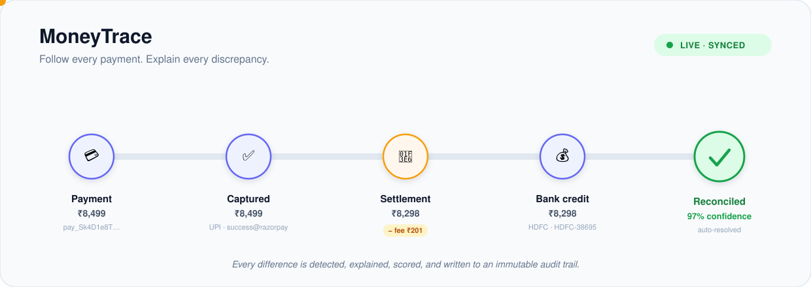
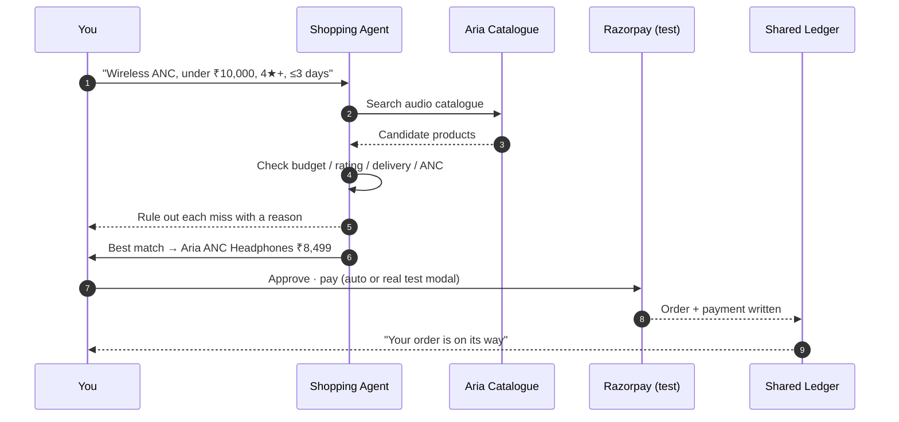
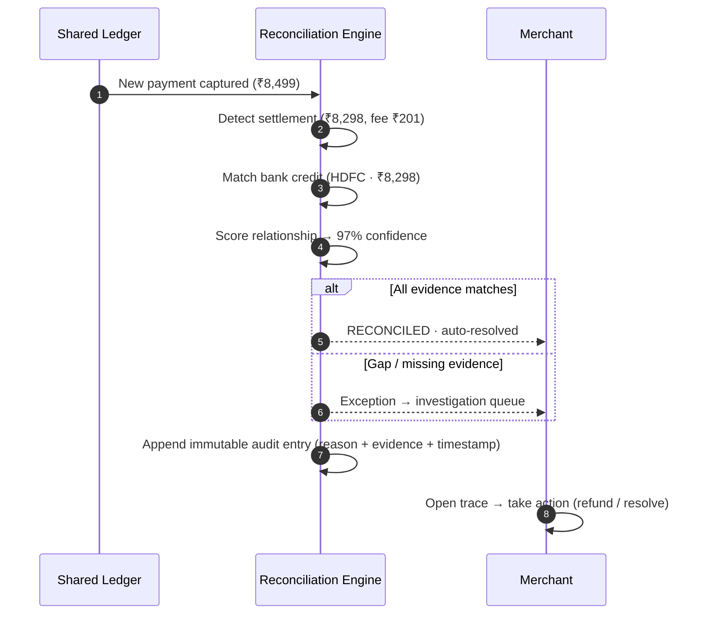

<div align="center">

# MoneyTrace

### Follow every payment. Explain every discrepancy.

**A dual-experience demo built for the Razorpay AI Buildathon — Open Track**

[](https://razorpay.com/buildathon/)
[](#tech-stack)
[](#payments--security)
[]()

[Live Demo](#-run-it-locally) · [Demo Video](#-demo-video) · [Architecture](#-architecture) ·[Uniqueness](#-why-this-isnt-a-clone-of-razorpays-agent-studio)

</div>

---

## 📌 The problem

Money moves through a payment stack in stages — **capture → settlement → bank credit** — and at every stage something can quietly go wrong: a partial capture, a delayed bank credit, a duplicate webhook, a refund issued after a payment was already reconciled. Today, closing that loop is manual:

- **Merchants** stare at spreadsheets trying to match orders to settlements, with no evidence trail for *why* something didn't reconcile.
- **Customers/agents** buying on their behalf have no visibility into why a payment succeeded, failed, or was retried.
- **Support teams** re-investigate the same discrepancy from scratch every time because there's no persistent, explainable audit trail.


## 💡 The solution

**MoneyTrace** is a two-sided demo that follows a *single payment* through its entire life, from both ends:

| Side | Who | What it does |
|---|---|---|
| 🛍️ **Aria Storefront** | Customer | An AI shopping agent that takes a budget + must-haves, searches, compares candidates, **explains why it rejected every product it didn't pick**, and pays hands-free via a real Razorpay test order. |
| 🧭 **MoneyTrace Console** | Merchant | A financial control center that traces that *same* payment from capture → settlement → bank credit, auto-reconciles it, and surfaces exactly what needs human review — with evidence, a confidence score, and an immutable audit trail. |

Both sides share **one ledger**. An order Aria places shows up live in the merchant console — so a judge (or a user) can watch one payment's full lifecycle from both perspectives in a single sitting.

---

## 🎥 Demo video

> 📹 **[Watch the 5-minute walkthrough →](#)** *(replace with your unlisted YouTube/Loom link before submission)*

<div align="center">
  <a href="#"></a>
</div>

---

## 🖼️ Screenshots

<table>
<tr>
<td width="50%">

**Aria Storefront — Agent shopping**
<br>

<sub>Agent compares candidates and explains rejections in real time</sub>

</td>
<td width="50%">

**Aria Storefront — Hands-free checkout**
<br>

<sub> Real Razorpay test payment</sub>

</td>
</tr>
<tr>
<td width="50%">

**MoneyTrace Console — Money trail**
<br>

<sub>Capture → settlement → bank credit, with reconciliation status</sub>

</td>
<td width="50%">

**MoneyTrace Console — Evidence & audit**
<br>

<sub>Every flagged discrepancy shown with evidence, confidence, and an immutable log</sub>

</td>
</tr>
</table>


---

## 🏗️ Architecture


<div align="center">

<a href="docs/architecture.svg">
  
</a>

</div>

**Core logic:**
- `lib/agent.ts` — Aria's decision engine: candidate search, scoring against budget/must-haves, and the rejection-explanation generator.
- `lib/scenarios.ts` — the Test Lab's scenario definitions (clean payment, refund-after-reconcile, partial capture, delayed bank, duplicate webhook, failed-then-retried) used to exercise the reconciliation engine against real failure modes.
- Shared state lives in `localStorage` 

---

## 🔄 Flow of each side

### Customer / agent flow


### Merchant / reconciliation flow



### 🛍️ Aria Storefront (Customer)

1. **Sign in as Shopper** and describe what you want — edit the request, set a budget, rating threshold, delivery window, and any hard constraints (e.g. ANC).
2. **Pick a scenario** in the Test Lab (clean payment, refund-after-reconcile, partial capture, delayed bank, duplicate webhook, failed-then-retried) and choose **Auto** (simulated) or **Real Razorpay window**.
3. **Run the agent.** Aria searches candidates, scores each one, and — critically — states *why* it rejected every product it didn't pick, not just why it picked the winner.
4. **Hands-free payment.** Aria creates a real Razorpay test order server-side and completes checkout, with a live coin animation tracking the payment.
5. **Check Orders** to see the money's journey begin.

### 🧭 MoneyTrace Console (Merchant)

1. **Sign in as Merchant** — the order Aria just placed is already there, live, from the shared ledger.
2. **Open the order** to see it traced: capture → settlement → bank credit, each stage timestamped.
3. **Reconciliation engine** auto-matches the order against settlement/bank data and returns a confidence score.
4. If something doesn't add up (partial capture, delayed credit, duplicate webhook, etc.), the console **surfaces evidence** for the discrepancy instead of a bare "flagged" label.
5. **Take action** — issue a refund, or mark resolved-after-review — and the action is written to an **immutable audit trail** so the reasoning is never lost.

---

## 🆚 Why this isn't a clone of Razorpay's Agent Studio

Razorpay's own **Agent Studio** and **Agentic Payments** platform (launched March–June 2026, built on Anthropic's Claude Agent SDK) already ship production agents for reconciliation, dispute response, cashflow forecasting, and conversational checkout. We built MoneyTrace *knowing that* — the goal wasn't to out-build a production fintech platform in a buildathon, it was to demonstrate the **specific mechanic** we think matters most and isn't the headline of their launch:

| | Razorpay Agent Studio (production) | MoneyTrace (this demo) |
|---|---|---|
| Reconciliation input | Upload a bank statement screenshot; agent extracts UTRs | Live-traces a payment automatically from capture through bank credit, no manual upload |
| Customer + merchant view | Separate products (Agentic Payments vs. Agentic Dashboard) | **One shared ledger** — the same order is visible, live, from both the buyer's and the seller's side in a single demo |
| Failure handling | Not publicly demoed with named scenarios | A **Test Lab** with six named, reproducible failure modes (partial capture, delayed bank, duplicate webhook, refund-after-reconcile, etc.) you can trigger on demand |
| Explainability | Flags discrepancies | Flags discrepancies **with evidence, a confidence score, and an immutable audit trail** attached to every flag |
| Agent transparency | Not demoed | Aria explains **why it rejected every non-chosen product**, not just why it picked the winner — the "explainability" mechanic is on the customer side too, not just the merchant side |


---


## 🔐 Payments & security

- Auto-checkout creates a **real Razorpay test order server-side** — API keys are never exposed to the client.
- The default path uses a simulated, auto-filled capture surface so the full flow can run hands-free (Razorpay's actual hosted checkout is a locked iframe that can't be auto-filled for demo purposes).
- Flip the payment toggle to **Real Razorpay window** to open Razorpay's actual test checkout modal.
- Add your Razorpay **test** keys to `.env.local` (see `.env.example`) to enable real test orders. Without keys, the app still runs end-to-end using an offline test order — no external dependency required to evaluate it.
- Every money action (payment, refund, resolution) is bounded to the Test Lab scenarios and written to the audit trail — nothing executes outside a traceable, explainable path.

---

## 🚀 Run it locally

```bash
npm install
npm run dev
# open http://localhost:3000
```

**Demo credentials** (pre-filled):

| Role | Email | Password |
|---|---|---|
| Shopper | `shopper@aria.store` | `shop123` |
| Merchant | `ops@ariacommerce.in` | `merchant123` |

**Demo flow:**
1. Sign in as **Shopper** → set budget/must-haves → pick a Test Lab scenario → run the agent → pay hands-free.
2. Open **Orders** to watch the payment's journey.
3. Sign out, sign in as **Merchant** → the order is already there → trace it, see why it reconciled (or didn't), take action.

---

## 🧱 Tech stack

**Next.js 16** (App Router) · **React 19** · **TypeScript** · **Tailwind v4** · **lucide-react**

State lives in `localStorage`; scenario logic in `lib/scenarios.ts`; agent logic in `lib/agent.ts`.


---

## 👤 Author

Built by [@fazilsourcecode](https://github.com/fazilsourcecode) for the **Razorpay AI Buildathon 2026 — Open Track**.

</div>
