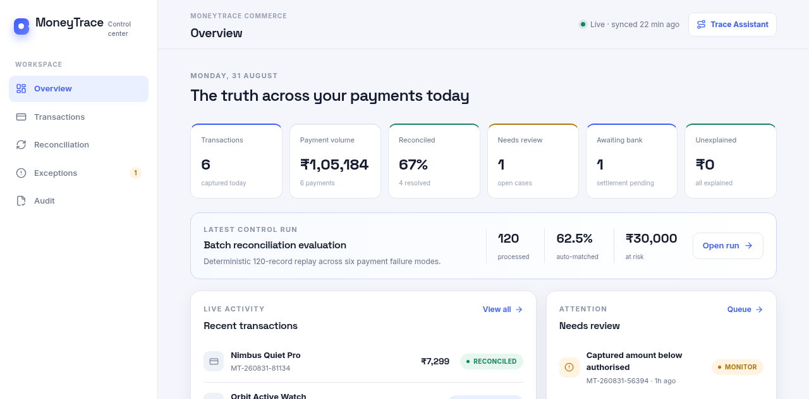
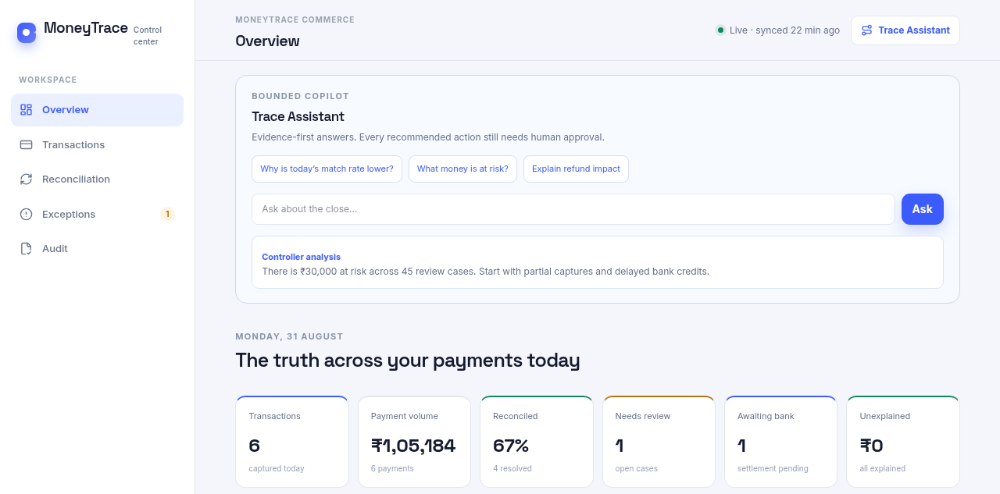
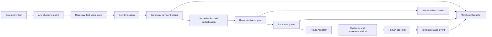
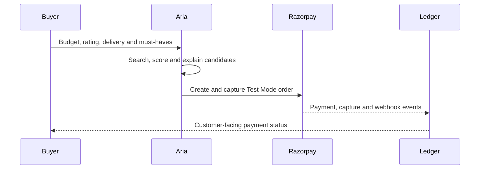
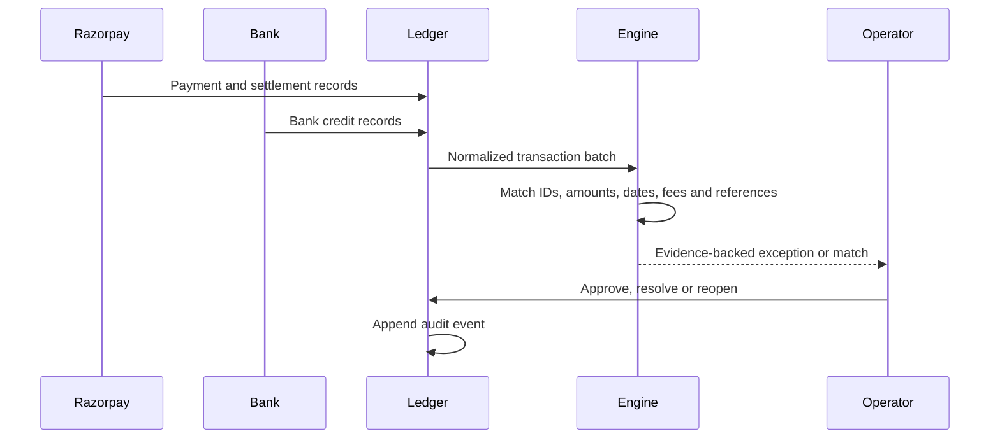

i mean it still looks like a normal dashboad in merchant side so make it like <div align="center">

# MoneyTrace Controller

### Explain every rupee after checkout.

**An evidence-first reconciliation layer for AI-initiated payments, built for the Razorpay AI Buildathon.**

[](https://nextjs.org/) [](https://razorpay.com/) [](https://razorpay.com/buildathon/)

[Demo video](#demo-video) · [Architecture](#architecture) · [Evaluation](#evaluation) · [Run locally](#run-locally)

</div>

---

## The problem

AI agents can now discover products and initiate payments, but finance teams still reconcile what happens after capture using spreadsheets, exports, and manual investigation. A payment is not finished when it succeeds: it must be matched to settlement, fees, bank credit, refunds, and webhook events.

A partial capture, delayed bank credit, duplicate webhook, or refund after reconciliation can create a real operational question: **where did the money go, and what evidence proves it?**

## The solution

MoneyTrace Controller gives the customer and merchant one connected story:

- **Aria Storefront** is a customer-facing shopping agent. It translates intent into constraints, compares products, explains rejected candidates, and creates a Razorpay Test Mode order.
- **MoneyTrace Console** is the finance control center. It follows the same transaction through capture → settlement → bank credit, detects exceptions, shows evidence, and records human-approved resolutions.
- **Trace Assistant** answers bounded questions about match rate, amount at risk, refund impact, and evidence. It recommends; a human approves money-changing actions.

> Razorpay enables the payment. MoneyTrace explains what happened to the money afterward.

## Demo video

Add the final unlisted YouTube or Loom URL here before submission:

`[Watch the 5-minute walkthrough](YOUR_DEMO_VIDEO_URL)`

Recommended recording: shopper intent → product reasoning → Test Mode checkout → merchant overview → batch evaluation → exception trace → assistant explanation → audit trail.

## Screenshots

Capture final screenshots from the running app and place them in `docs/screenshots/`:

| Surface | Evidence | What judges should see |
|---|---|---|
| Controller overview |  | Close KPIs, match rate, amount at risk, evaluation run |
| Trace Assistant |  | Bounded, evidence-first copilot with human approval language |
| Aria product reasoning | Capture as `aria-shopping.png` | Intent, constraints, candidate comparison, rejection reasons |
| Checkout trace | Capture as `aria-checkout.png` | Test Mode payment and lifecycle handoff |
| Reconciliation detail | Capture as `console-trail.png` | Capture, settlement, bank credit, evidence, confidence |
| Exception queue and audit | Capture as `console-exceptions.png` and `console-audit.png` | Prioritized review work and immutable history |

## Architecture



### Payment-side flow



### Finance-side flow



## Data model

```text
Order
 ├── payment: order id, payment id, captured amount, attempts
 ├── settlement: gross, fee, net, settlement status
 ├── bank: credited amount, bank reference, credit timestamp
 ├── reconciliation: state, confidence, reason, unexplained amount
 ├── trace[]: lifecycle nodes with status and amount
 ├── exceptions[]: priority, confidence, amount at stake
 └── events[]: append-only audit history
```

The app includes an offline synthetic evaluation batch so judges can run the full experience without external services. Razorpay credentials are only used server-side for Test Mode order creation; simulated mode remains available for repeatable evaluation.

## What makes it different

Razorpay Agent Studio is a broad platform for payment and revenue agents. MoneyTrace is a focused, inspectable control layer for the post-payment problem:

| Capability | MoneyTrace Controller |
|---|---|
| Customer and finance perspective | One connected payment story across both sides |
| Failure handling | Six reproducible scenarios: partial capture, delayed bank, duplicate webhook, refund-after-reconcile, failed retry, and clean payment |
| Explainability | Evidence, confidence, amount variance, and reason attached to every decision |
| Agent transparency | Aria explains why rejected products did not satisfy constraints |
| Human control | Assistant recommends; resolution and money-changing actions require operator intent |
| Evaluation | Deterministic 120-record replay with match rate, review volume, false flags, and amount at risk |

## Evaluation

The in-app evaluation run uses 120 synthetic records distributed across clean payments and known failure modes. Metrics are generated by `lib/evaluation.ts`, not manually typed into the interface.

The controller reports:

- Records processed
- Auto-matched records
- Review and unresolved records
- Match rate
- False-flag rate on clean records
- Amount at risk
- Exception categories and evidence

Before submitting, record the exact output from the app here and include the dataset version. Do not replace these values with estimates.

## Known limitations

- The demo ledger is browser-local so the preview works without provisioning a database; a production deployment should move this ledger to a durable, tenant-scoped database.
- Synthetic settlement and bank events model real operational failure modes but are not live bank integrations.
- The assistant is intentionally bounded and deterministic in offline mode; it does not independently issue refunds or alter financial records.
- Razorpay Test Mode is used for demonstration. No real money is moved.

## Run locally

```bash
npm install
npm run dev
```

Open `http://localhost:3000`.

| Role | Demo email | Password |
|---|---|---|
| Shopper | `shopper@aria.store` | `shop123` |
| Merchant | `ops@ariacommerce.in` | `merchant123` |

### Suggested judging path

1. Enter the shopper experience and run Aria against a constrained request.
2. Complete simulated checkout or open the Razorpay Test Mode window.
3. Enter the merchant console and open the latest transaction.
4. Review the 120-record evaluation strip and exception queue.
5. Ask Trace Assistant why the match rate or amount at risk changed.
6. Open a trace and inspect evidence, recommended action, and audit history.

## Security and payment handling

- Razorpay secrets remain server-side and are never embedded in client components.
- Test Mode and simulated checkout are clearly separated from production payment claims.
- Assistant actions are bounded, explainable, and approval-oriented.
- Payment events are deduplicated conceptually through event identity and trace state.
- The production roadmap requires tenant isolation, durable storage, signed webhook verification, idempotency keys, and role-based approvals.

## Tech stack

Next.js 16 · React 19 · TypeScript · Tailwind CSS v4 · lucide-react · Razorpay Test Mode · deterministic reconciliation/evaluation engine.

## Roadmap

1. Durable tenant-scoped ledger with Postgres.
2. Signed webhook ingestion and idempotent event processing.
3. Bank statement connectors and one-to-many settlement matching.
4. Production AI copilot with cited evidence and approval workflows.
5. Role-based access, exports, alerts, and close-period controls.

## Author

Built by [@fazilsourcecode](https://github.com/fazilsourcecode) for the Razorpay AI Buildathon.
